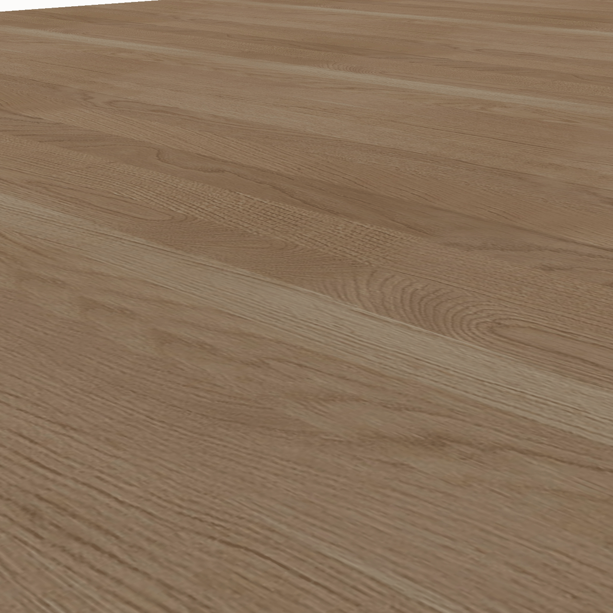

## 📌 Project Overview

This is the official codebase for the paper:  
**PhyBlock: A Progressive Benchmark for Physical Understanding and Planning via 3D Block Assembly**

The repository includes code for dataset usage, model evaluation, and benchmark protocols.

👉 The corresponding dataset is available on [PhyBlock_Benchmark](https://huggingface.co/datasets/PhyBlock/PhyBlock_Benchmark) as an official release.


---

## 🏗️ Evaluation Framework for Vision-Based Block Construction

This evaluation framework is designed to assess the performance of vision-language models (VLMs) in generating accurate block assembly plans based on visual inputs.

### Step 1: Generate Raw Outputs with VLMs

First, use the provided inference scripts in the [`inference_scripts`](https://github.com/PhyBlock/PhyBlock/tree/main/inference_scripts) directory to generate raw outputs from different models. Each model produces predictions for 400 block assembly scenarios in JSON format.

Sample outputs for each model are available in the [`outputs`](https://github.com/PhyBlock/PhyBlock/tree/main/outputs) directory. These raw JSON files serve as the input for the evaluation pipeline.


### Step 2: Run Evaluation on Raw Outputs

To evaluate the raw predictions, you need the following inputs:

| Argument                 | Description                                                                                                                                                       |
| ------------------------ | ----------------------------------------------------------------------------------------------------------------------------------------------------------------- |
| `--raw_outputs_json_dir` | Directory containing the raw output JSON files generated by a VLM.                                                                                                |
| `--matching_json_dir`    | Directory containing candidate block JSONs. See [`SCENEs_400_Cand_Jsons`](https://github.com/PhyBlock/PhyBlock/tree/main/data/SCENEs_400_Cand_Jsons).             |
| `--groundtruth_json_dir` | Directory containing ground-truth goal structure JSONs. See [`SCENEs_400_Goal_Jsons`](https://github.com/PhyBlock/PhyBlock/tree/main/data/SCENEs_400_Goal_Jsons). |
| `--extracted_json_dir`   | Output directory for saving parsed and extracted assembly sequences.                                                                                              |
| `--results_dir`          | Directory for saving evaluation results in CSV and TXT formats.                                                                                                   |

Then run the following command to start the evaluation:

```bash
python evaluate_block_construction.py
```


### Step 3: Got Output Structure

The evaluation results will be saved in the specified `results_dir`, and include:

```
results_dir/
├── Results_level1.csv       # Metrics for Level 1 evaluation (basic match)
├── Results_level234.csv     # Metrics for Levels 2-4 (increasing reasoning complexity)
└── Results_Levels.txt       # Summary report across all four evaluation levels
```


---

## 🎞️ Model Predictions Visualization

Below are example predictions from different vision-language models on the block assembly task. Each GIF shows the step-by-step construction process generated by a specific model.

<p align="center">
  
  
  
  
  <br>
  
  
  
  
</p>

> 📌 *Each GIF corresponds to a different model. The animations visualize how each model interprets the goal and assembles the blocks step-by-step.*

---


